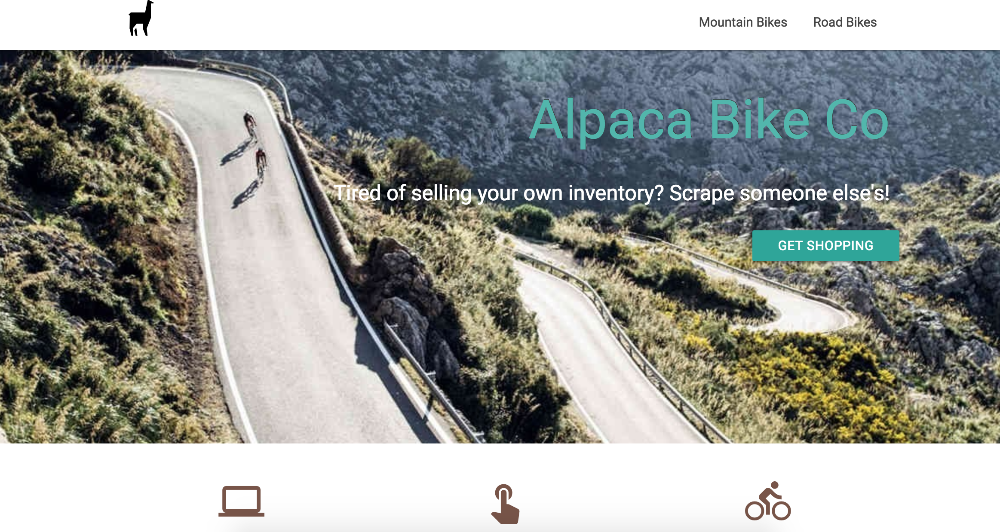
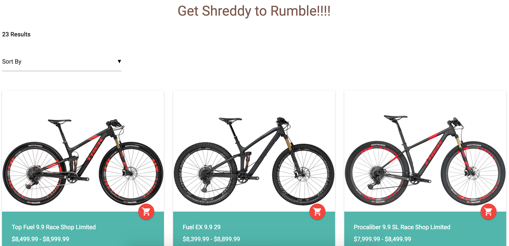
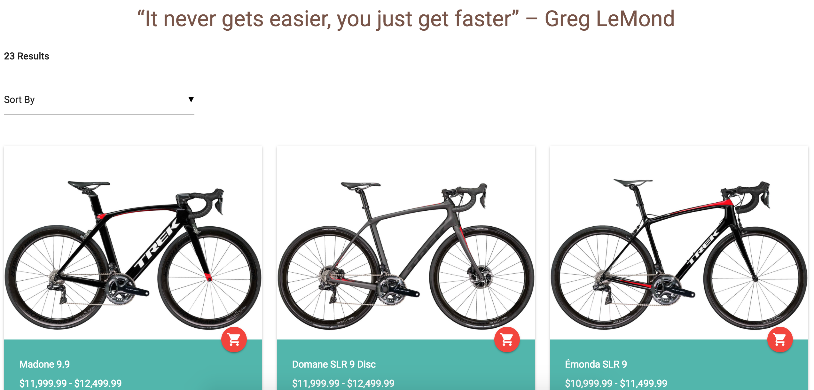
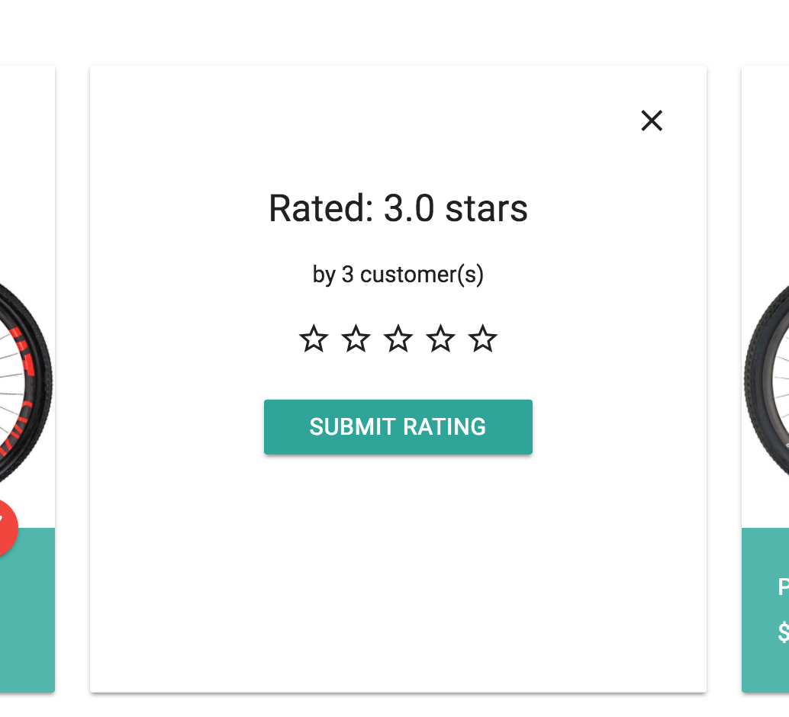

# webScraper
> Retail Website using Cheerio JS and Request JS to scrape bicycle inventory from Trekbikes.com

### Home 

### Mountain Bike Inventory 

### Road Bike Inventory 

### Bike Star Rating 

## Authors

- Fred Lintz - (https://github.com/fredlintz5)

## Contributing

1. Fork it (<https://github.com/fredlintz5/webScraper/fork>)
2. Create your feature branch (`git checkout -b feature/fooBar`)
3. Commit your changes (`git commit -am 'Add some fooBar'`)
4. Push to the branch (`git push origin feature/fooBar`)
5. Create a new Pull Request

